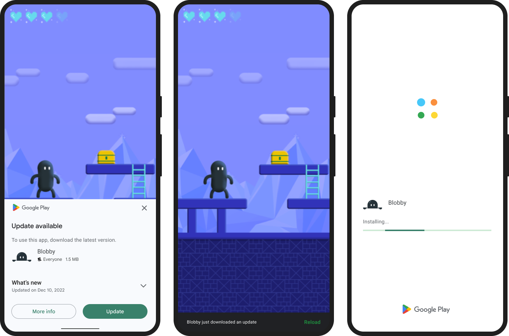

# Flutter Upgrade Version Package

A Flutter plugin for Android, iOS allowing get information about package, version info.

|                | Android | iOS      |
|----------------|:-:|:-:|
| **Support**   |`:white_check_mark:` |`:white_check_mark:`| 


## Features

* Get Package Information (app name, package name, version, build number).
* Get Information of Version at store (CH Play, Apple Store).
* Support In App Update - Android

## Installation

First, add `flutter_upgrade_version` as a [dependency in your pubspec.yaml file](https://flutter.dev/using-packages/).

```dart
    dependencies
        flutter_upgrade_version: ^1.0.8
```

## In-app Updates

The in-app updates feature is supported on devices running Android 5.0 (API level 21) or higher. Additionally, in-app updates are only supported for Android mobile devices, Android tablets, and ChromeOS devices.

Your app can use the Google Play Core libraries to support the following UX flows for in-app updates:

### Flexible Update Flows

Flexible updates provide background download and installation with graceful state monitoring. This UX flow is appropriate when it's acceptable for the user to use the app while downloading the update. For example, you might want to encourage users to try a new feature that's not critical to the core functionality of your app.




### Immediate Update Flows

Immediate updates are fullscreen UX flows that require the user to update and restart the app in order to continue using it. This UX flow is best for cases where an update is critical to the core functionality of your app. After a user accepts an immediate update, Google Play handles the update installation and app restart.


## Usage

You can use FlutterUpgradeVersion to get information about the package.

```dart
import 'package:flutter_upgrade_version/flutter_upgrade_version.dart';

Future<void> getPackageData() async {
    PackageInfo _packageInfo = await PackageManager.getPackageInfo();

    ///
    ///_packageInfo.appName;
    ///_packageInfo.packageName;
    ///_packageInfo.version;
    ///_packageInfo.buildNumber;
  }
```

You can get the app information on the Store through ID - package_name. You need to make sure the ID alrealy exits on the Store.

```dart
///Short Syntax - Support Android & iOS
///This function is a combination of two functions:  UpgradeVersion.getAndroidStoreVersion &  UpgradeVersion.getiOSStoreVersion
VersionInfo? _versionInfo = await UpgradeVersion.getUpgradeVersionInfo();

/// Android
if (Platform.isAndroid) {
  InAppUpdateManager manager = InAppUpdateManager();
  AppUpdateInfo? appUpdateInfo = await manager.checkForUpdate();
  if (appUpdateInfo == null) return; //Exception
  if (appUpdateInfo.updateAvailability == UpdateAvailabilitydeveloperTriggeredUpdateInProgress) {
    //If an in-app update is already running, resume the update.
    String? message = await manager.startAnUpdate(type: AppUpdateType.immediate);
    ///message return null when run update success 
  } else if (appUpdateInfo.updateAvailability == UpdateAvailability.updateAvailable) {
    ///Update available
    if (appUpdateInfo.immediateAllowed) {
      debugPrint('Start an immediate update');
      String? message = await manager.startAnUpdate(type: AppUpdateType.immediate);
      ///message return null when run update success 
    } else if (appUpdateInfo.flexibleAllowed) {
      debugPrint('Start an flexible update');
      String? message = await manager.startAnUpdate(type: AppUpdateType.flexible);
      ///message return null when run update success
    } else {
      debugPrint('Update available. Immediate & Flexible Update Flow not allow');
    }
  }
}

///
///iOS
if (Platform.isIOS) {
  VersionInfo? _versionInfo2 = await UpgradeVersion.getiOSStoreVersion(_packageInfo);
}

```

With <span style='color:blue'>VersionInfo</span> class, I have provided information about:
 
* **canUpdate**: Return **true** if app can update.

* **isReviewing**: Return **true** if app is reviewing.

* **localVersion**: The current version of app.

* **storeVersion**: The current version of app on the store.

* **appStoreLink**: Link connect to App Store.

* **releaseNotes**: The notes of version on the store.


### In-app Update message

| Message | Description |
|----------------|----------------|
| **MSG_USER_HAS_DENIED_OR_CANCELED_THE_UPDATE** | The user has denied or canceled the update. | 
| **MSG_RESULT_IN_APP_UPDATE_FAILED** | Some other error prevented either the user from providing consent or the update from proceeding.|
| **MSG_APP_UPDATE_TYPE_NO_SUPPORT** | AppUpdateType not support|
| **MSG_REQUIRE_CHECK_FOR_UPDATE** | Required call `checkForUpdate` before `startAnUpdate` |
| **MSG_UPDATE_LISTENER_ERROR**| |